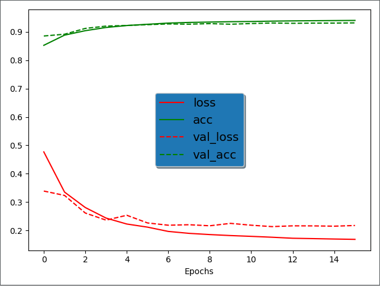
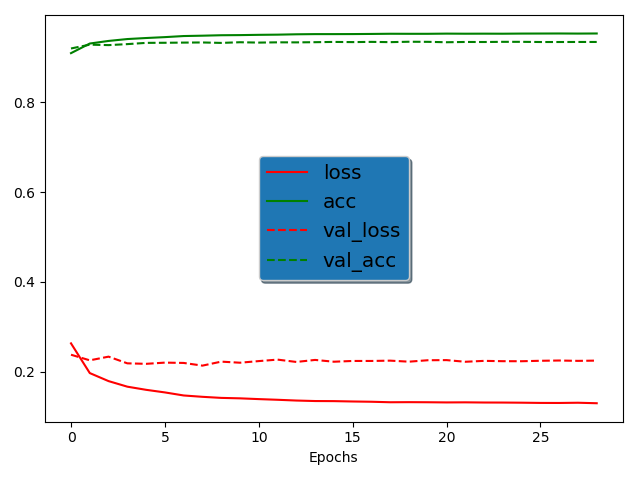
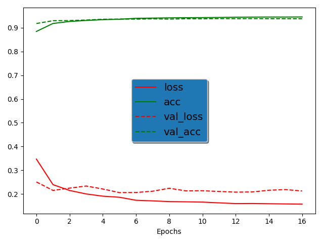
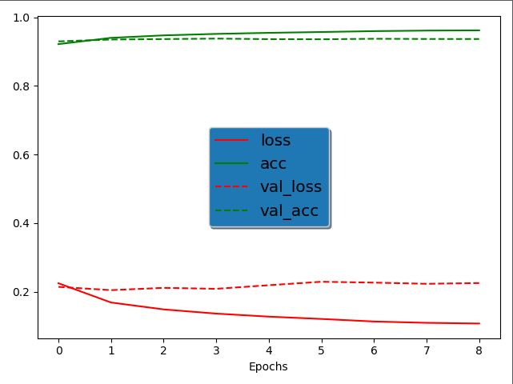
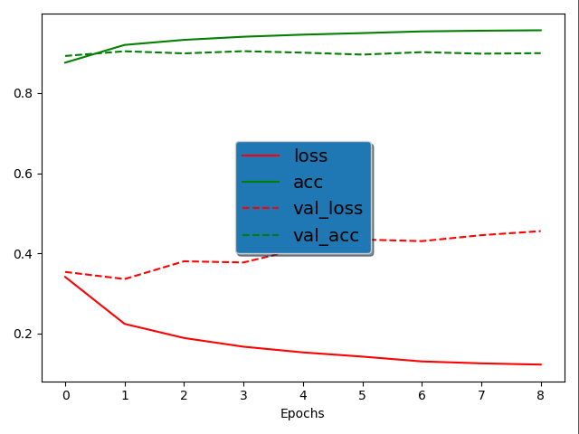
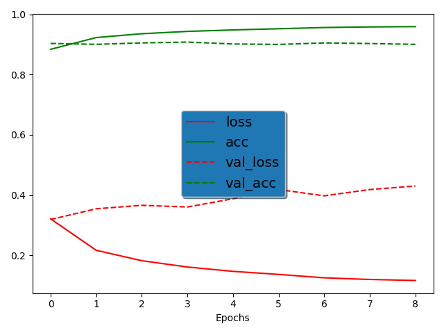

Here we are using MobileNet, VGG16, Resnet, VGGFace(with VGG16 model) and NASNet networks.

For each networks, initial learning rate is set to 0.005 and is divided by 2 each 6 epochs

You can tune the batch composition in `dataset_tool.py`, here we have batches representative of the used dataset

The trains are done on 2.000.000 images from VGGFace2 dataset and stoped when accuracy seem stable

Weights gave by training are available in the folder `trained_networks`

The matrix structure:

|  | African predicted    | Asian predicted      | Latin/Caucasian predicted       |    Indian predicted  |
|:----:|:----:|:-----:|:------:|:----:|
|Real Africans|   |     |     |     |
|Real Asian|    |   |     |    |
|Real Latin/Caucasian|    |    |   |   |
|Real Indians|     |      |     |   |

#### 1. Batches respecting proportions

Until we have big steps in ethnicities proportions in the dataset, we try to keep the same proportions in each batch, so here we got around 6% Africans, 8% Asians, 80% Latin/Caucasian and 6% Indians in each batch

##### 1.1. Results for ResNet

After 16 epochs (around 36 hours on the workstation), we got `loss: 0.1684 - acc: 0.9406 - val_loss: 0.2173 - val_acc: 0.9319`.

learning rate = 0.005

This is the confusion matrix computer on testSet:

|      |       |        |      |
|:----:|:-----:|:------:|:----:|
| 7774 |  112  |  1296  |  82  |
|  290 | 16214 |  2950  |  171 |
|  619 |  1053 | 129441 | 2395 |
|  79  |   77  |  2016  | 4455 |

And this is a normalized version of this matrix:

|      |       |        |      |
|:----:|:-----:|:------:|:----:|
| 0.839|   0.012  |   0.140  |  0.009  |
|  0.015 |  0.826 |  0.150  |  0.009 |
|  0.005 |   0.008 | 0.969 | 0.018 |
|  0.012  |    0.012  |  0.304  | 0.672 |

##### 1.2. Results for MobileNet

After 29 epochs `loss: 0.1296 - acc: 0.9535 - val_loss: 0.2246 - val_acc: 0.9346`.

learning rate = 0.005

This is the confusion matrix computer on testSet:

|      |       |        |      |
|:----:|:-----:|:------:|:----:|
| 7925 |  60  |  1168  |  111  |
|  251 | 16517 |  2650  |  270 |
|  832 |  1096 | 129019 | 2561 |
|  41  |   61  |  1763  | 4762 |

And this is a normalized version of this matrix:

|      |       |        |      |
|:----:|:-----:|:------:|:----:|
| 0.855|   0.006  |   0.126  |  0.013  |
|  0.013 |  0.842 |  0.135  |  0.010 |
|  0.006 |   0.008 | 0.966 | 0.019 |
|  0.006  |    0.009  |  0.266  | 0.719 |

##### 1.3. Results for VGG16

After 17 epochs, we got `loss: 0.1570 - acc: 0.9457 - val_loss: 0.2124 - val_acc: 0.9381`.

learning rate = 0.005

This is the confusion matrix computer on testSet:

|      |       |        |      |
|:----:|:-----:|:------:|:----:|
| 7852 |  88  |  1252  |  72  |
|  198 | 16917 |  2396  |  114 |
|  614 |  867 | 129628 | 2399 |
|  48  |   43  |  1831  | 4705 |

And this is a normalized version of this matrix:

|      |       |        |      |
|:----:|:-----:|:------:|:----:|
| 0.848|   0.009  |   0.135  |  0.008  |
|  0.010 |  0.862 |  0.122  |  0.006 |
|  0.005 |   0.006 | 0.971 | 0.018 |
|  0.007  |    0.007  |  0.276  | 0.710 |

##### 1.4. Results for VGGFace

After 9 epochs

learning rate = 0.0005

This is the confusion matrix computer on testSet:

|      |       |        |      |
|:----:|:-----:|:------:|:----:|
| 7927 |  61  |  1146  |  130  |
|  185 | 16914 |  2327  |  199 |
|  767 |  930 | 128992 | 2819 |
|  33  |   39  |  1664  | 4891 |

And this is a normalized version of this matrix:

|      |       |        |      |
|:----:|:-----:|:------:|:----:|
| 0.856|   0.006  |   0.124  |  0.014  |
|  0.009 |  0.862 |  0.119  |  0.010 |
|  0.006 |   0.007 | 0.966 | 0.021 |
|  0.005  |    0.006  |  0.251  | 0.738 |

#### 2. Batches homogeneous

Here we tried to use homogeneous ethnicity repartition in each batch, so each batch should contain 25% of each ethnicity.

##### 2.1. Results for Resnet

After 9 epochs

learning rate = 0.005

This is the confusion matrix computer on testSet:

|      |       |        |      |
|:----:|:-----:|:------:|:----:|
| 8475 |  86  |  585  |  118  |
|  316 | 17986 |  1013  |  310 |
|  2379 |  2458 | 123645 | 5026 |
|  84  |   136  |  821  | 5586 |

And this is a normalized version of this matrix:

|      |       |        |      |
|:----:|:-----:|:------:|:----:|
| 0.915|   0.009  |   0.063  |  0.013  |
|  0.016 |  0.916 |  0.052  |  0.016 |
|  0.018 |   0.018 | 0.926 | 0.038 |
|  0.013  |    0.021  |  0.124  | 0.843 |

##### 2.3. Results for VGG16

After 9 epochs 

learning rate = 0.0005

This is the confusion matrix computer on testSet:

|      |       |        |      |
|:----:|:-----:|:------:|:----:|
| 8373 |  127  |  610  |  154  |
|  183 | 18343 |  825  |  274 |
|  1586 |  2485 | 124507 | 4930 |
|  41  |   151  |  614  | 5821 |

And this is a normalized version of this matrix:

|      |       |        |      |
|:----:|:-----:|:------:|:----:|
| 0.904|   0.014  |   0.066  |  0.016  |
|  0.009 |  0.935 |  0.042  |  0.014 |
|  0.012 |   0.019 | 0.932 | 0.037 |
|  0.006  |    0.023  |  0.093  | 0.878 |

##### 2.4. Results for VGGFace

After 9 epochs

learning rate = 0.0005

This is the confusion matrix computer on testSet:

|      |       |        |      |
|:----:|:-----:|:------:|:----:|
| 8369 |  101  |  657  |  137  |
|  301 | 18087 |  964  |  273 |
|  1976 |  2329 | 124545 | 4658 |
|  59  |   106  |  768  | 5694 |

And this is a normalized version of this matrix:

|      |       |        |      |
|:----:|:-----:|:------:|:----:|
| 0.903|   0.011  |   0.071  |  0.015  |
|  0.015 |  0.922 |  0.049  |  0.014 |
|  0.015 |   0.017 | 0.933 | 0.035 |
|  0.009  |    0.016  |  0.116  | 0.859 |

##### Result Summary

As it was expected, on balanced batches, results are more balanced (not latin/caucasian specialised)

#### 3. Best loss

We tried to evaluate the networks for the epoch with the smallest loss on validation set to see the differences (the training is the same)

##### 3.1. Results for ResNet

We used here the epoch 12

This is the confusion matrix computer on testSet:

|      |       |        |      |
|:----:|:-----:|:------:|:----:|
| 7841 |  121  |  1197  |  105  |
|  329 | 16125 |  3018  |  153 |
|  710 |  1129 | 129307 | 2362 |
|  77  |   73  |  1985  | 4492 |

And this is a normalized version of this matrix:

|      |       |        |      |
|:----:|:-----:|:------:|:----:|
| 0.847 |   0.013  |   0.129  |  0.011  |
|  0.017 |  0.822 |  0.153  |  0.008 |
|  0.005 |   0.008 | 0.969 | 0.018 |
|  0.012  |    0.011  |  0.299  | 0.698 |

##### 3.2. Results for MobileNet

We used here the epoch 8

learning rate = 0.005

This is the confusion matrix computer on testSet:

|      |       |        |      |
|:----:|:-----:|:------:|:----:|
| 7902 |  55  |  1169  |  138  |
|  287 | 16310 |  2803  |  225 |
|  848 |  1084 | 129045 | 2531 |
|  40  |   60  |  1821  | 4706 |

And this is a normalized version of this matrix:

|      |       |        |      |
|:----:|:-----:|:------:|:----:|
| 0.853 |   0.006  |   0.126  |  0.015  |
|  0.015 |  0.831 |  0.143  |  0.011 |
|  0.006 |   0.008 | 0.967 | 0.019 |
|  0.006  |    0.009  |  0.275  | 0.710 |

And using the balanced training, with the same experiment, we got at epoch 5:

learning rate = 0.005

This is the confusion matrix computer on testSet:

|      |       |        |      |
|:----:|:-----:|:------:|:----:|
| 8446 |  132  |  486  |  200  |
|  499 | 17919 |  828  |  429 |
|  3384 |  3678 | 120062 | 6384 |
|  130  |   156  |  567  | 5774 |

And this is a normalized version of this matrix:

|      |       |        |      |
|:----:|:-----:|:------:|:----:|
| 0.912 |   0.014  |   0.052  |  0.022  |
|  0.023 |  0.913 |  0.042  |  0.022 |
|  0.025 |   0.028 | 0.899 | 0.048 |
|  0.020  |    0.023  |  0.086  | 0.871 |

##### 3.3. Results for VGG16

After 6 epochs

learning rate = 0.005

This is the confusion matrix computer on testSet:

|      |       |        |      |
|:----:|:-----:|:------:|:----:|
| 8049 |  106  |  1031  |  78  |
|  300 | 16922 |  2319  |  84 |
|  932 |  1059 | 129273 | 2244 |
|  117  |   69  |  1796  | 4645 |

And this is a normalized version of this matrix:

|      |       |        |      |
|:----:|:-----:|:------:|:----:|
| 0.869|   0.011  |   0.111  |  0.009  |
|  0.016 |  0.862 |  0.118  |  0.004 |
|  0.007 |   0.008 | 0.968 | 0.017 |
|  0.018  |    0.011  |  0.271  | 0.700 |

And using the balanced training, with the same experiment, we got at epoch 3:

learning rate = 0.0005

This is the confusion matrix computer on testSet:

|      |       |        |      |
|:----:|:-----:|:------:|:----:|
| 8600 |  89  |  475  |  100  |
|  285 | 18196 |  853  |  291 |
|  2115 |  2402 | 124207 | 4784 |
|  96  |   92  |  579  | 5860 |

And this is a normalized version of this matrix:

|      |       |        |      |
|:----:|:-----:|:------:|:----:|
| 0.928|   0.010  |   0.051  |  0.011  |
|  0.015 |  0.927 |  0.043  |  0.015 |
|  0.016 |   0.018 | 0.930 | 0.036 |
|  0.014  |    0.014  |  0.087  | 0.884 |

##### 3.4. Results for VGGFace

After 2 epochs

learning rate = 0.0005

This is the confusion matrix computer on testSet:

|      |       |        |      |
|:----:|:-----:|:------:|:----:|
| 8074 |  40  |  1058  |  92  |
|  357 | 16798 |  2290  |  180 |
|  1043 |  1072 | 128465 | 2928 |
|  124  |   96  |  1448  | 4959 |

And this is a normalized version of this matrix:

|      |       |        |      |
|:----:|:-----:|:------:|:----:|
| 0.872|   0.004  |   0.114  |  0.010  |
|  0.018 |  0.856 |  0.117  |  0.009 |
|  0.008 |   0.008 | 0.962 | 0.022 |
|  0.019  |    0.014  |  0.219  | 0.748 |

#### 4. Relabeled dataset
We asked to two persons from different ethnicties (John which is from Congo and Muhammad which is from Pakistan) to do annotations for the dataset to avoid a biased labelling. 

We merged the three annotations using the following rules:

1. For the same identity, if at least 2 annotations are the same, we keep this annotation
2. If the three labels are different, we do a tie-break: a fourth annotator chose the labels of the identity 

For all training we use now learning rate of 0.0005

##### 4.1. Results for ResNet

We trained on 15 epochs

This is the confusion matrix computer on testSet:

|      |       |        |      |
|:----:|:-----:|:------:|:----:|
| 8450 |  67  | 1705   |  151  |
|  119 | 16358 |  2040  |  233 |
|  396 |  1049 | 127768 | 1687 |
|  238  |   385  |  2290  | 6088 |

And this is a normalized version of this matrix:

|      |       |        |      |
|:----:|:-----:|:------:|:----:|
| 0.815 |   0.006  |   0.164  |  0.015  |
|  0.006 |  0.873 |  0.109  |  0.012 |
|  0.003 |   0.008 | 0.976 | 0.013 |
|  0.026  |    0.043  |  0.255  | 0.676 |

accuracy = 0.9387069291934873

And at the epoch 2 (with the lowest loss on the validation set):

This is the confusion matrix computer on testSet:

|      |       |        |      |
|:----:|:-----:|:------:|:----:|
| 8311 |  55  |  1820  |  187  |
|  208 | 15598 |  2633  |  311 |
|  446 |  1002 | 127919 | 1533 |
|  270  |   311  |  2479  | 5941 |

And this is a normalized version of this matrix:

|      |       |        |      |
|:----:|:-----:|:------:|:----:|
| 0.801 |   0.005  |   0.176  |  0.018  |
|  0.011 |  0.832 |  0.140  |  0.017 |
|  0.003 |   0.008 | 0.977 | 0.012 |
|  0.030  |    0.035  |  0.275  | 0.660 |

##### 4.2. Results for MobileNet

We trained on 13 epochs

This is the confusion matrix computer on testSet:

|      |       |        |      |
|:----:|:-----:|:------:|:----:|
| 8078 |  112  |  2046   |  137  |
|  213 | 15041 |  3245  |  251 |
|  461 |  1116 | 127843 | 1480 |
|  284  |   335  |  2921  | 5461 |

And this is a normalized version of this matrix:

|      |       |        |      |
|:----:|:-----:|:------:|:----:|
| 0.779 |   0.011  |   0.197  |  0.013  |
|  0.011 |  0.802 |  0.173  |  0.014 |
|  0.003 |   0.009 | 0.977 | 0.011 |
|  0.032  |    0.037  |  0.324  | 0.607 |

And at the epoch 11 (with the lowest loss on the validation set):

This is the confusion matrix computer on testSet:

This is the confusion matrix computer on testSet:

|      |       |        |      |
|:----:|:-----:|:------:|:----:|
| 8078 |  112  |  2046   |  137  |
|  213 | 15041 |  3245  |  251 |
|  461 |  1116 | 127843 | 1480 |
|  284  |   335  |  2921  | 5461 |

And this is a normalized version of this matrix:

|      |       |        |      |
|:----:|:-----:|:------:|:----:|
| 0.779 |   0.011  |   0.197  |  0.013  |
|  0.011 |  0.802 |  0.173  |  0.014 |
|  0.003 |   0.009 | 0.977 | 0.011 |
|  0.032  |    0.037  |  0.324  | 0.607 |

##### 4.3. Results for VGG16

We trained on 20 epochs

This is the confusion matrix computer on testSet:

|      |       |        |      |
|:----:|:-----:|:------:|:----:|
| 8500 |  60  |  1685   |  128  |
|  79 | 16675 |  1779  |  217 |
|  396 |  944 | 127909 | 1651 |
|  197  |   417  |  2056  | 6331 |

And this is a normalized version of this matrix:

|      |       |        |      |
|:----:|:-----:|:------:|:----:|
| 0.820 |   0.006  |   0.162  |  0.012  |
|  0.004 |  0.889 |  0.095  |  0.012 |
|  0.003 |   0.007 | 0.977 | 0.013 |
|  0.022  |    0.046  |  0.229  | 0.703 |

accuracy = 0.9431500851950019

And at the epoch 2 (with the lowest loss on the validation set):

This is the confusion matrix computer on testSet:

This is the confusion matrix computer on testSet:

|      |       |        |      |
|:----:|:-----:|:------:|:----:|
| 8212 |  112  |  1924   |  125  |
|  115 | 16773 |  1693  |  169 |
|  346 |  1138 | 127531 | 1885 |
|  189  |   473  |  1907  | 6432 |

And this is a normalized version of this matrix:

|      |       |        |      |
|:----:|:-----:|:------:|:----:|
| 0.792 |   0.011  |   0.185  |  0.012  |
|  0.006 |  0.895 |  0.090  |  0.009 |
|  0.003 |   0.009 | 0.974 | 0.014 |
|  0.021  |    0.052  |  0.212  | 0.715 |

##### 4.4. Results for VGGFace

We trained on 15 epochs

This is the confusion matrix computer on testSet:

|      |       |        |      |
|:----:|:-----:|:------:|:----:|
| 8301 |  49  |  1806   |  217  |
|  144 | 16320 |  2092  |  194 |
|  402 |  931 | 127753 | 1814 |
|  219  |   386  |  1968  | 6428 |

And this is a normalized version of this matrix:

|      |       |        |      |
|:----:|:-----:|:------:|:----:|
| 0.800 |   0.005  |   0.174  |  0.021  |
|  0.008 |  0.870 |  0.112  |  0.010     |
|  0.003 |   0.007 | 0.976 | 0.014 |
|  0.024  |    0.043  |  0.219  | 0.714 |

And at the epoch 3 (with the lowest loss on the validation set):

This is the confusion matrix computer on testSet:

This is the confusion matrix computer on testSet:

|      |       |        |      |
|:----:|:-----:|:------:|:----:|
| 8371 |  44  |  1764   |  194  |
|  196 | 16135 |  2171  |  248 |
|  549 |  1077 | 127399 | 1875 |
|  244  |   401  |  2018  | 6338 |

And this is a normalized version of this matrix:

|      |       |        |      |
|:----:|:-----:|:------:|:----:|
| 0.807 |   0.004  |   0.170  |  0.019  |
|  0.010 |  0.861 |  0.116  |  0.013 |
|  0.004 |   0.008 | 0.973 | 0.015 |
|  0.027  |    0.045  |  0.224  | 0.704 |

Accuracy = 0.9362161586520258
