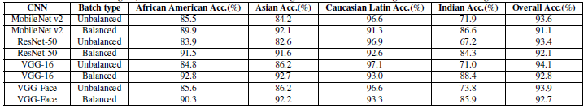

Here we are using MobileNet, VGG16, Resnet, VGGFace(with VGG16 model) and NASNet networks.

For each networks, initial learning rate is set to 0.005 and is divided by 2 each 6 epochs

You can tune the batch composition in `dataset_tool.py`, here we have batches representative of the used dataset

The trains are done on 2.000.000 images from VGGFace2 dataset and stoped when accuracy seem stable

Weights gave by training are available in the folder `trained_networks`

The matrix structure:

|  | African predicted    | Asian predicted      | Latin/Caucasian predicted       |    Indian predicted  |
|:----:|:----:|:-----:|:------:|:----:|
|Real Africans|   |     |     |     |
|Real Asian|    |   |     |    |
|Real Latin/Caucasian|    |    |   |   |
|Real Indians|     |      |     |   |

#### 1. Batches respecting proportions

Until we have big steps in ethnicities proportions in the dataset, we try to keep the same proportions in each batch, so here we got around 6% Africans, 8% Asians, 80% Latin/Caucasian and 6% Indians in each batch

##### 1.1. Results for ResNet

After 16 epochs (around 36 hours on the workstation), we got `loss: 0.1684 - acc: 0.9406 - val_loss: 0.2173 - val_acc: 0.9319`.

learning rate = 0.005

This is the confusion matrix computer on testSet:

|      |       |        |      |
|:----:|:-----:|:------:|:----:|
| 7774 |  112  |  1296  |  82  |
|  290 | 16214 |  2950  |  171 |
|  619 |  1053 | 129441 | 2395 |
|  79  |   77  |  2016  | 4455 |

And this is a normalized version of this matrix:

|      |       |        |      |
|:----:|:-----:|:------:|:----:|
| 0.839|   0.012  |   0.140  |  0.009  |
|  0.015 |  0.826 |  0.150  |  0.009 |
|  0.005 |   0.008 | 0.969 | 0.018 |
|  0.012  |    0.012  |  0.304  | 0.672 |

##### 1.2. Results for MobileNet

After 16 epochs.

learning rate = 0.005

This is the confusion matrix computer on testSet:

|      |       |        |      |
|:----:|:-----:|:------:|:----:|
| 7925 |  60  |  1168  |  111  |
|  251 | 16517 |  2650  |  270 |
|  832 |  1096 | 129019 | 2561 |
|  41  |   61  |  1763  | 4762 |

And this is a normalized version of this matrix:

|      |       |        |      |
|:----:|:-----:|:------:|:----:|
| 0.855|   0.006  |   0.126  |  0.013  |
|  0.013 |  0.842 |  0.135  |  0.010 |
|  0.006 |   0.008 | 0.966 | 0.019 |
|  0.006  |    0.009  |  0.266  | 0.719 |

##### 1.3. Results for VGG16

After 17 epochs, we got `loss: 0.1570 - acc: 0.9457 - val_loss: 0.2124 - val_acc: 0.9381`.

learning rate = 0.005

This is the confusion matrix computer on testSet:

|      |       |        |      |
|:----:|:-----:|:------:|:----:|
| 7852 |  88  |  1252  |  72  |
|  198 | 16917 |  2396  |  114 |
|  614 |  867 | 129628 | 2399 |
|  48  |   43  |  1831  | 4705 |

And this is a normalized version of this matrix:

|      |       |        |      |
|:----:|:-----:|:------:|:----:|
| 0.848|   0.009  |   0.135  |  0.008  |
|  0.010 |  0.862 |  0.122  |  0.006 |
|  0.005 |   0.006 | 0.971 | 0.018 |
|  0.007  |    0.007  |  0.276  | 0.710 |

##### 1.4. Results for VGGFace

After 9 epochs

learning rate = 0.0005

This is the confusion matrix computer on testSet:

|      |       |        |      |
|:----:|:-----:|:------:|:----:|
| 7927 |  61  |  1146  |  130  |
|  185 | 16914 |  2327  |  199 |
|  767 |  930 | 128992 | 2819 |
|  33  |   39  |  1664  | 4891 |

And this is a normalized version of this matrix:

|      |       |        |      |
|:----:|:-----:|:------:|:----:|
| 0.856|   0.006  |   0.124  |  0.014  |
|  0.009 |  0.862 |  0.119  |  0.010 |
|  0.006 |   0.007 | 0.966 | 0.021 |
|  0.005  |    0.006  |  0.251  | 0.738 |

#### 2. Batches homogeneous

Here we tried to use homogeneous ethnicity repartition in each batch, so each batch should contain 25% of each ethnicity.

##### 2.1. Results for Resnet

After 9 epochs

learning rate = 0.005

This is the confusion matrix computer on testSet:

|      |       |        |      |
|:----:|:-----:|:------:|:----:|
| 8475 |  86  |  585  |  118  |
|  316 | 17986 |  1013  |  310 |
|  2379 |  2458 | 123645 | 5026 |
|  84  |   136  |  821  | 5586 |

And this is a normalized version of this matrix:

|      |       |        |      |
|:----:|:-----:|:------:|:----:|
| 0.915|   0.009  |   0.063  |  0.013  |
|  0.016 |  0.916 |  0.052  |  0.016 |
|  0.018 |   0.018 | 0.926 | 0.038 |
|  0.013  |    0.021  |  0.124  | 0.843 |

##### 2.3. Results for VGG16

After 9 epochs

learning rate = 0.0005

This is the confusion matrix computer on testSet:

|      |       |        |      |
|:----:|:-----:|:------:|:----:|
| 8373 |  127  |  610  |  154  |
|  183 | 18343 |  825  |  274 |
|  1586 |  2485 | 124507 | 4930 |
|  41  |   151  |  614  | 5821 |

And this is a normalized version of this matrix:

|      |       |        |      |
|:----:|:-----:|:------:|:----:|
| 0.904|   0.014  |   0.066  |  0.016  |
|  0.009 |  0.935 |  0.042  |  0.014 |
|  0.012 |   0.019 | 0.932 | 0.037 |
|  0.006  |    0.023  |  0.093  | 0.878 |

##### 2.4. Results for VGGFace

After 9 epochs

learning rate = 0.0005

This is the confusion matrix computer on testSet:

|      |       |        |      |
|:----:|:-----:|:------:|:----:|
| 8369 |  101  |  657  |  137  |
|  301 | 18087 |  964  |  273 |
|  1976 |  2329 | 124545 | 4658 |
|  59  |   106  |  768  | 5694 |

And this is a normalized version of this matrix:

|      |       |        |      |
|:----:|:-----:|:------:|:----:|
| 0.903|   0.011  |   0.071  |  0.015  |
|  0.015 |  0.922 |  0.049  |  0.014 |
|  0.015 |   0.017 | 0.933 | 0.035 |
|  0.009  |    0.016  |  0.116  | 0.859 |

##### Result Summary

As it was expected, on balanced batches, results are more balanced (not latin/caucasian specialised)

#### 3. Best loss

We tried to evaluate the networks for the epoch with the smallest loss on validation set to see the differences (the training is the same)

##### 3.1. Results for Resnet

We used here the epoch 12

This is the confusion matrix computer on testSet:

|      |       |        |      |
|:----:|:-----:|:------:|:----:|
| 7841 |  121  |  1197  |  105  |
|  329 | 16125 |  3018  |  153 |
|  710 |  1129 | 129307 | 2362 |
|  77  |   73  |  1985  | 4492 |

And this is a normalized version of this matrix:

|      |       |        |      |
|:----:|:-----:|:------:|:----:|
| 0.847 |   0.013  |   0.129  |  0.011  |
|  0.017 |  0.822 |  0.153  |  0.008 |
|  0.005 |   0.008 | 0.969 | 0.018 |
|  0.012  |    0.011  |  0.299  | 0.698 |

##### 3.3. Results for VGG16

After 6 epochs

learning rate = 0.005

This is the confusion matrix computer on testSet:

|      |       |        |      |
|:----:|:-----:|:------:|:----:|
| 8049 |  106  |  1031  |  78  |
|  300 | 16922 |  2319  |  84 |
|  932 |  1059 | 129273 | 2244 |
|  117  |   69  |  1796  | 4645 |

And this is a normalized version of this matrix:

|      |       |        |      |
|:----:|:-----:|:------:|:----:|
| 0.869|   0.011  |   0.111  |  0.009  |
|  0.016 |  0.862 |  0.118  |  0.004 |
|  0.007 |   0.008 | 0.968 | 0.017 |
|  0.018  |    0.011  |  0.271  | 0.700 |

And using the balanced training, with the same experiment, we got at epoch 3:

learning rate = 0.0005

This is the confusion matrix computer on testSet:

|      |       |        |      |
|:----:|:-----:|:------:|:----:|
| 8600 |  89  |  475  |  100  |
|  285 | 18196 |  853  |  291 |
|  2115 |  2402 | 124207 | 4784 |
|  96  |   92  |  579  | 5860 |

And this is a normalized version of this matrix:

|      |       |        |      |
|:----:|:-----:|:------:|:----:|
| 0.928|   0.010  |   0.051  |  0.011  |
|  0.015 |  0.927 |  0.043  |  0.015 |
|  0.016 |   0.018 | 0.930 | 0.036 |
|  0.014  |    0.014  |  0.087  | 0.884 |

##### 3.4. Results for VGGFace

After 2 epochs

learning rate = 0.0005

This is the confusion matrix computer on testSet:

|      |       |        |      |
|:----:|:-----:|:------:|:----:|
| 8074 |  40  |  1058  |  92  |
|  357 | 16798 |  2290  |  180 |
|  1043 |  1072 | 128465 | 2928 |
|  124  |   96  |  1448  | 4959 |

And this is a normalized version of this matrix:

|      |       |        |      |
|:----:|:-----:|:------:|:----:|
| 0.872|   0.004  |   0.114  |  0.010  |
|  0.018 |  0.856 |  0.117  |  0.009 |
|  0.008 |   0.008 | 0.962 | 0.022 |
|  0.019  |    0.014  |  0.219  | 0.748 |

