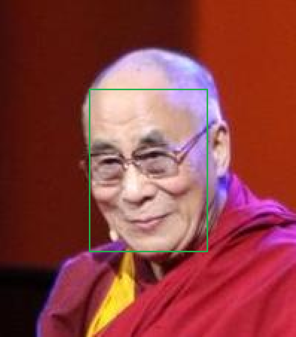

Here is the VGG2 database with XML allowing to link an id (given by the folder name) to the ethnicity

Ethnicity = 1, 2 or 3 respectively for African, Asian and Latins
(4 indian, 6 other)

Most of the ethnicity labels are hand-checked (excepted Latin with index over 5350)
The database is available on [VGGFace2 official page](http://www.robots.ox.ac.uk/~vgg/data/vgg_face2/ "Google's Homepage")

`new_identity_meta.csv` gives Name, Number of samples, Flag, Gender and Ethnicity labels

In the bb_landmark folder, we got ground truth for the face (`loose_bb_*.csv`) and some landmarks (`loose_landmark_*.csv`) which give positions of eyes, nose and mouth.

Lab gave me some scripts done by other students (`Script_*` folders)

In `Data/labels`, `homgeneous*.txt` are subsets of train and test sets containing the same number of each ethnicity to perform a better learning.

There are more and more scripts which are not used now, I should do a refactor to clear that

The working Networks are in `Networks_antonio_like` directory